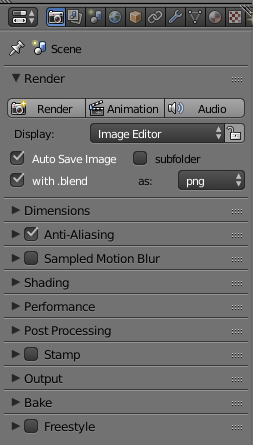

# Blender auto save on render add-on
A Blender add-on to auto save image and blend file after render. This is a simple  file based "version control" system. Optionally, a markdown log file of each render can be produced, allowing for a "commit" message to be added to each auto-save.

The add-on creates pairs of images and blend files with the same version number. The images can be browsed (either in a file explorer of through the log file in a markdown previewer). Then the actual blend file used to create the image can be accessed along with any comments made at render time. Extra comments can be added to the log file at anytime to create a record of project progress or to review the project.

In my workflow I often create many images at low resolution or low samples from the same basic blend file. Between images I will have varied camera position or lighting or other details. When I identify the best image I can go back and open the blend file and create a high resolution, high quality image.

Derivation of Auto Save add-on by Florian Meyer
http://wiki.blender.org/index.php/Extensions:2.6/Py/Scripts/Render/Auto_Save

original code
https://svn.blender.org/svnroot/bf-extensions/contrib/py/scripts/addons/render_auto_save.py

This version adds an option to also auto save .blend file after render, and to create a markdown log file.

On the first render with the Auto Save Render add-on enabled, and "with log file" checked, the add-on will add a text-data-block called "save log" to the Blender file. To see this after the first render use the "Browse text to be linked" drop down to make the "save log" the active text block. Add any comments desired. To save a copy externally to Blender use the "Text > Save As" menu. The default save name has been set to "blendfilebasename_log.md". This can be changed but the markdown file link format requires the log file be in the same folder as the auto-saved images.

The add-on settings are found on the Render panel. The default save name has been set to "blendfilebasename_log.md". This can be changed but the markdown file link format requires the log file be in the same folder as the auto-saved images.



With "Auto Save Image" and "with .blend" set and the file "\Documents\test.blend" open, after rendering the following files will be created  

`\Documents\auto_saves\test_001.png`  
`\Documents\auto_saves\test_001.blend`    

If "subfolder" is also set the files will be created in a sub-folder named after the blend file.  

`\Documents\auto_saves\test\test_001.png`    
`\Documents\auto_saves\test\test_001.blend`  

The version number will be incremented with each render.  

It is up to the user to make sure any additional files required such as texture images have been packed into the blend file.  

`File>External Data>Pack All into .blend`

After three renders the log file might look like this

```
**celadon_glaze_001** {2018-04-13 16:51}

Render time: 0:00:20.183531

**celadon_glaze_002** {2018-04-13 16:57}

Render time: 0:00:20.045838

**celadon_glaze_003** {2018-04-13 17:11}

Render time: 0:00:20.356762
```

See [blog post](http://elfnor.com/update-to-blender-auto-save-add-on.html) for more info.
