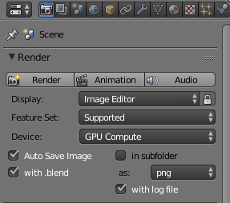

# Blender auto save on render add-on
Blender add-on to auto save image and blend file after render.

It creates pairs of images and blend files with the same version number. This means the images can be browsed and the actual blend file used to create the image accessed. In my workflow I often create many images at low resolution or low samples from the same basic blend file. Between images I will have varied camera position or lighting or other details. When I identify the best image I can go back and open the blend file and create a high resolution, high quality image.

Derivation of Auto Save add-on by Florian Meyer
http://wiki.blender.org/index.php/Extensions:2.6/Py/Scripts/Render/Auto_Save

original code
https://svn.blender.org/svnroot/bf-extensions/contrib/py/scripts/addons/render_auto_save.py

This version adds an option to also auto save .blend file after render.  

The add-on settings are found on the Render panel.  

With "Auto Save Image" and "with .blend" set and the file "\Documents\test.blend" open, after rendering the following files will be created  

\Documents\auto_saves\test_001.png  
\Documents\auto_saves\test_001.blend  

If "subfolder" is also set the files will be created in a sub-folder named after the blend file.  

\Documents\auto_saves\test\test_001.png  
\Documents\auto_saves\test\test_001.blend  

The version number will be incremented with each render.  

It is up to the user to make sure any additional files required such as texture images have been packed into the blend file.  

File>External Data>Pack All into .blend

